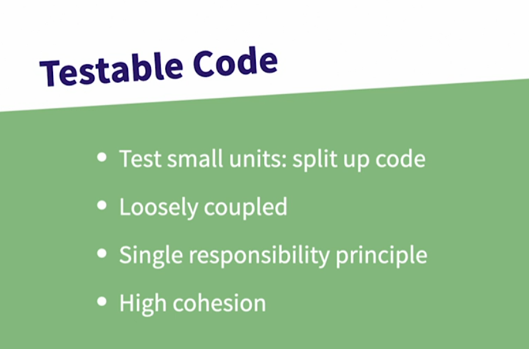
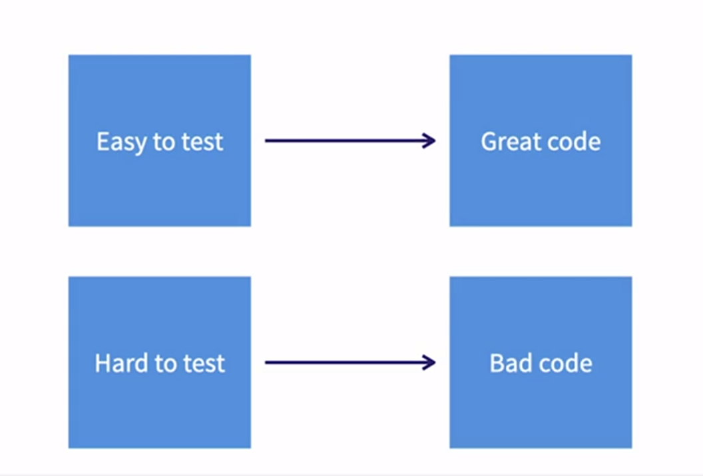
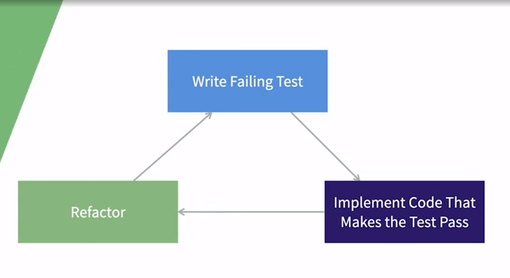
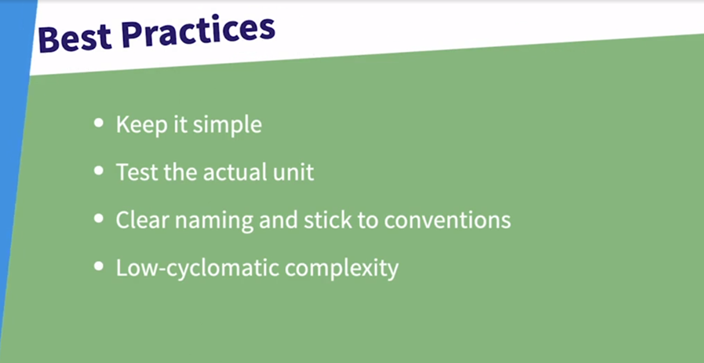
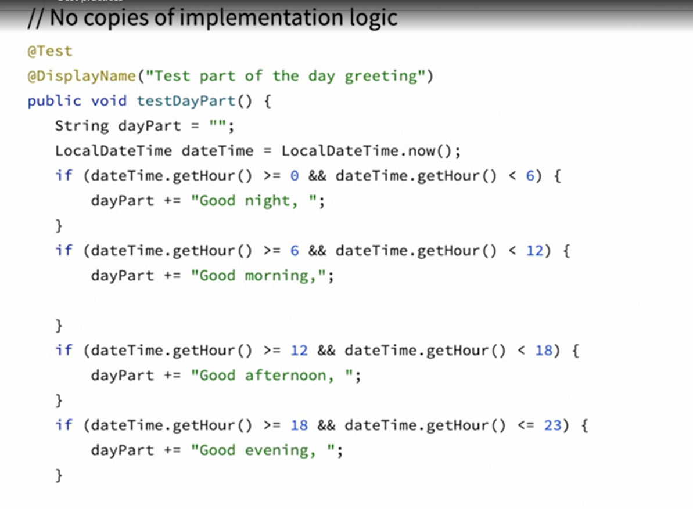
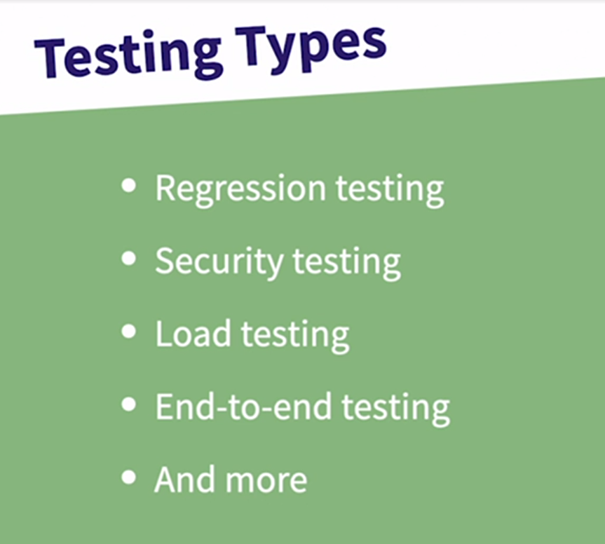
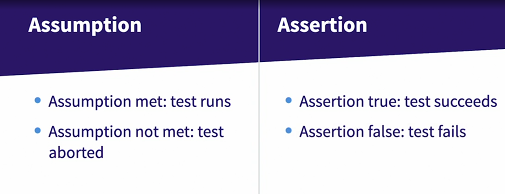
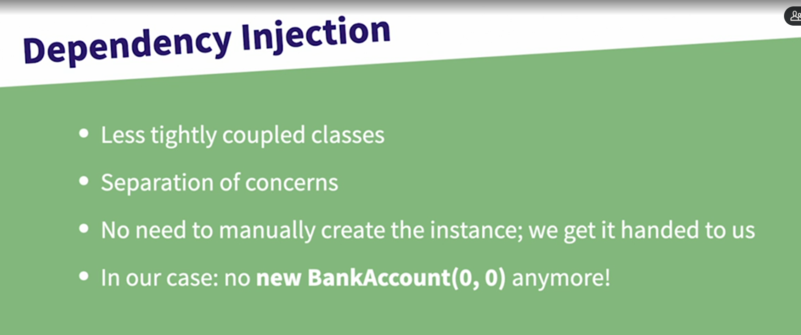
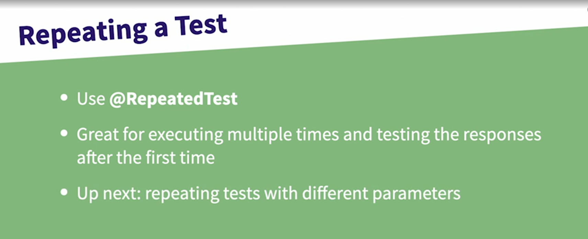
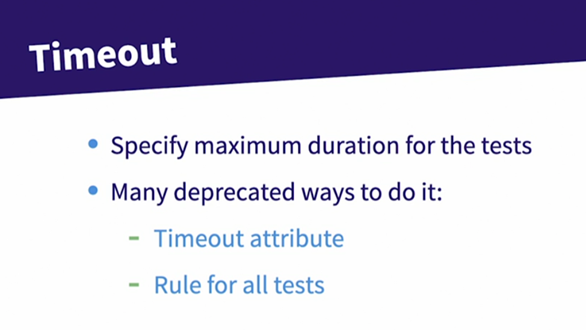

# junit
# learning linkedin junit
[linked in course](https://www.linkedin.com/learning/java-testing-with-junit-14267963)  

# testable code
  
  
- small units
- loosely couple 
    - few dependencies
- single responsibility
    - test just one thing
- high cohesion
    - put the test in the right class

# testable code : when it happens
if code is testable if 
- does not have to many dependencies (loosely couple)
- each method do just one thing (single responsibility)
- each method belongs to the right class (hight cohesion)


# testing lifecycle
  
1.  write test for fail
2. make it pass
3. refactor the code and keep the test minimum

# testing best practices
  
- low cyclomatic complexity
    - few conditionals, this makes the code easier to debug
- test just one thing
    - easy to debug and hard to break

## no copies of implementation logic
because if there is a problem with the implementation, you just replicate that fail
- you should focus on the expected result, rather than copy the implementation
  

## deterministic test
- the output should be always the same
- in order to do this, the code should be loosely couple
  


# Testing types
  
  
# unit testing
testing classes and modules
# system testing
testing whole apis or ui system
# integration testing
testing connection between the systems
# acceptance testing
final user accepts the system
# performance testing
the system has good performance
# regression testing
testing the whole system after small change
# security testing
testing the security of the system
# load testing
testing the capacity of system to support large user amount
# end-to-end testing
emulates a user interacting with the system


# Test Driven Development
✅ force the developer think on requirement before implementation (step 1 and 2)  
✅ test are not skipped (step 1 and 2)  
✅ bugs spotted early (step 1 and 2)  
✅ force the developer to write better and   cleaner code (refactor stage) (step 3)

# Test Driven Development : process
1. write filing test
2. write pass test
3. refactor

# Unit test , JUnit advantages
✅ spot bugs early (due to new features or wrong business understanding)
    ✅ save time and money
✅ force the download developer to write better and cleaner code (refactor stage)

# junit: code : basic unit test
```java
import static org.junit.jupiter.api.Assertions.*;
import org.junit.jupiter.api.Test;

public void testSayHello(){
    assertEquals("i world", "i world");
}

testSayHello();
```

```java
package com.example;
import static org.junit.jupiter.api.Assertions.*;
import org.junit.jupiter.api.Test;

public class CodeTest 
{
    @Test
    public void testSayHello(){
        Code code = new Code();
        assertEquals("hi world", code.sayHello());
    }
}
```

# junit annotations
- are use in the junit context execution
- usually the context is enable when we use mvn test

# @Test annotation
you need to mark the method with @Test annotation in order to be executed by testing context

```java
public class BankAccountTest {
    @Test    
    public void testWithdrow(){
        BankAccount account = new BankAccount(100, 0);
        account.withdraw(50);
        assertEquals(50, account.getBalance());
    }

    @Test    
    public void testDeposit(){
        BankAccount account = new BankAccount(1000,100);
        account.deposit(1000);
        assertEquals(2000, account.getBalance());
    }
}
```

# naming our tests
- improve the report

# @DisplayName annotation
give a descriptive name to the test method or class

# Assertions
- check situations, conditions, values...

# Assertions : assertThrows
```java
import static org.junit.jupiter.api.Assertions.*;
assertThrows(RuntimeException.class, () -> {
    int a = 1/0;
});
```

# Assertions : assertAll
- receives a list of executable
- if one of then fails, then it fails
- useful for check flow over one object

```java
import static org.junit.jupiter.api.Assertions.*;
assertAll(
    () -> assertEquals(4, 2 * 2),
    () -> assertEquals("java", "JAVA".toLowerCase()),
    () -> assertNull(null)
);
```

# Assertions : assertFalse
```java
import static org.junit.jupiter.api.Assertions.*; 
assertFalse(false);
```

# Assertions : assertTrue
```java
import static org.junit.jupiter.api.Assertions.*;
assertTrue(true);
```

# Assertions : assertEquals
```java
import static org.junit.jupiter.api.Assertions.*;
assertEquals(50, 40+10);
```

# Assertions : assertNotEquals
```java
import static org.junit.jupiter.api.Assertions.*; 
assertNotEquals(50, 40+1);
```

# Assertions : assertNull
```java
import static org.junit.jupiter.api.Assertions.*; 
assertNull(null);
```

# Assertions : assertNotNull
```java
import static org.junit.jupiter.api.Assertions.*; 
assertNotNull(1);
```

# Assertions : assertTimeout

```java
import static org.junit.jupiter.api.Assertions.*;
import java.time.Duration;
assertTimeout(Duration.ofMillis(100), () -> {
    Thread.sleep(50);
});
```
# Assertions : assertEquals with delta
```java
import static org.junit.jupiter.api.Assertions.*;
assertEquals(0.333, 1/3, 0.5); 
```

# Junit fail

```java
import static org.junit.jupiter.api.Assertions.*;
fail("this is the error");
```

# Assumptions
- conditions do check if a test should be execute or not
- useful for abort a test
  

# Assumptions : @assumingThat
```java
import static org.junit.jupiter.api.Assertions.*;
import static org.junit.jupiter.api.Assumptions.*;
assumingThat(false, () -> {
    assertEquals(1, 6);    
});
assertEquals(1, 1);
```

# Assumptions : @assumeTrue
```java
import static org.junit.jupiter.api.Assumptions.*;
import static org.junit.jupiter.api.Assertions.*;
assumeTrue(false);
```

# Test order
- without specifying, the order can't be predict
- test should be independent
- in some cases is necessary to execute integration test at the end
- or some test a the beginning

# Test order : by @TestMethodOrder annotation
- let you execute methods by @Order annotation, method name or @DisplayName annotation

# Test order : by @Order annotation
```java
package com.example;

import static org.junit.jupiter.api.Assertions.assertEquals;

import org.junit.jupiter.api.MethodOrderer;
import org.junit.jupiter.api.Order;
import org.junit.jupiter.api.Test;
import org.junit.jupiter.api.TestMethodOrder;

@TestMethodOrder(MethodOrderer.OrderAnnotation.class)
public class BankAccountOrderedExecutionTest {
    static BankAccount account = new BankAccount(0, 0, true, "daniel");

    @Test
    @Order(1)
    public void testDeposit(){
        account.deposit(500);
        assertEquals(500, account.getBalance());
    }

    @Test
    @Order(2)
    public void testWithdraw(){
        account.withdraw(200);
        assertEquals(300, account.getBalance());
    }
}
```

# Test nested
- useful for compose test
```java
@Nested
class WhenBalanceEqualsZero {
    @Test
    public void testWithdrawMinimumBalanceIs(){
        BankAccount account = new BankAccount(10, 0, true, "daniel");
        account.withdraw(1);
        assertEquals(9, account.getBalance());
        assertThrows(RuntimeException.class, () -> {
            account.withdraw(5000);
        });
    }

    @Test
    public void testWithdrawMinimumBalanceNegative(){
        BankAccount account = new BankAccount(0, -1000, true, "daniel");
        account.withdraw(1);
        assertEquals(-1, account.getBalance());
        assertThrows(RuntimeException.class, () -> {
            account.withdraw(10);
        });
    }
} 
```

# unit Dependency injection with unit test
  

# ParameterResolver
```java
package com.example;

import org.junit.jupiter.api.extension.ExtensionContext;
import org.junit.jupiter.api.extension.ParameterContext;
import org.junit.jupiter.api.extension.ParameterResolutionException;
import org.junit.jupiter.api.extension.ParameterResolver;

public class BankAccountParameterResolver 
implements ParameterResolver{
@Override
    public boolean supportsParameter(ParameterContext parameterContext, ExtensionContext arg1) throws ParameterResolutionException {
        return parameterContext.getParameter().getType() == BankAccount.class;
    }

    @Override
    public Object resolveParameter(ParameterContext parameterContext, ExtensionContext arg1) throws ParameterResolutionException {
        return new BankAccount(0, 0, true, "daniel");
    }
}
```

# unit @ExtendWith
let the test inject certain classes
```java
package com.example;

import static org.junit.jupiter.api.Assertions.assertEquals;

import org.junit.jupiter.api.Test;
import org.junit.jupiter.api.extension.*;

@ExtendWith(BankAccountParameterResolver.class)
public class BankAccountDITest {

    @Test
    public void testDeposit(BankAccount account){
        account.deposit(500);
        assertEquals(500, account.getBalance());
    }
} 
```

# Repeated test
- let you execute a test n times
    - give you the repetition context
  
```java
@RepeatedTest(5)
public void testWithdrowWithInfo(BankAccount account, RepetitionInfo repetitionInfo){
    account.deposit(100 * repetitionInfo.getCurrentRepetition());
    assertEquals(100 * repetitionInfo.getCurrentRepetition(), account.getBalance());
}
```


# Parameterized test, parameter test
clean way to run test with different values
```java
@ParameterizedTest
@ValueSource(ints = {100,400,800,1000})
public void testWithdrowWithParameter(int amount, BankAccount account){
    account.deposit(amount);
    assertEquals(amount, account.getBalance());
}
```

# Parameterized test, parameter test
clean way to run test with different values

# test with list
```java
@ParameterizedTest
@ValueSource(ints = {100,400,800,1000})
public void testWithdrowWithParameter(int amount, BankAccount account){
    account.deposit(amount);
    assertEquals(amount, account.getBalance());
}
```

# test with enum
```java
@ParameterizedTest
@EnumSource(value=DayOfWeek.class, names = {"SATURDAY","SUNDAY"})
public void testWithdrowWithParameterDayOfWeek(DayOfWeek dayOfWeek){
    assertTrue(dayOfWeek.name().toLowerCase().contains("u"));
}
```

# test with csv
- expects a list of String values
- or the path for csv file (for this one we need another annotation)
```java
@ParameterizedTest
@CsvSource({"100, Daniel", "200, Alejo"})
public void testWithdrowWithParameterCsv(int amount, String holder, BankAccount account){
    account.setHolderName(holder);
    account.deposit(amount);
    assertEquals(amount, account.getBalance());
    assertEquals(holder, account.getHolderName());
}
```

# test with csv file
- you should receive each column as an argument
```java
@ParameterizedTest
@CsvFileSource(resources = "/accounts.csv", numLinesToSkip = 1)
public void testWithdrowWithParameterCsvFile(int amount, String holder, BankAccount account){
    account.setHolderName(holder);
    account.deposit(amount);
    assertEquals(amount, account.getBalance());
    assertEquals(holder, account.getHolderName());
}
```

# test with timeout
- timeout is applied for all the asserts in the method, assertTimeout is apply just to one assert
  
- if the test is not executed in the specific time, then it fails
```java
@Test    
//@Timeout(value = 10, unit = TimeUnit.NANOSECONDS) //fails
@Timeout(value = 10, unit = TimeUnit.SECONDS)
public void testWithdrowTimeout(BankAccount account){
    try{
        Thread.sleep(1000);
    }catch(InterruptedException e){
        e.printStackTrace(); 
    }
    account.deposit(300);
    assertEquals(300, account.getBalance());
}
```

- the timeout restrictions could be applied at class level
```java
@Timeout(value = 10, unit = TimeUnit.SECONDS)
public class BankAccountNestedTest {
    @Test    
    public void testWithdrow(){
        BankAccount account = new BankAccount(300, 0, true, "alejo");
        account.withdraw(200);
        assertEquals(100, account.getBalance());
    }

    @Test    
    public void testDeposit(){
        BankAccount account = new BankAccount(0, 0, true, "daniel");
        account.deposit(500);
        assertEquals(500, account.getBalance());
    }

    @Nested
    class WhenBalanceEqualsZero {
        @Test
        public void testWithdrawMinimumBalanceIs(){
            BankAccount account = new BankAccount(10, 0, true, "daniel");
            account.withdraw(1);
            assertEquals(9, account.getBalance());
            assertThrows(RuntimeException.class, () -> {
                account.withdraw(5000);
            });
        }

        @Test
        public void testWithdrawMinimumBalanceNegative(){
            BankAccount account = new BankAccount(0, -1000, true, "daniel");
            account.withdraw(1);
            assertEquals(-1, account.getBalance());
            assertThrows(RuntimeException.class, () -> {
                account.withdraw(5000);
            });
        }
    }
}
```

- assertTimeout is equivalent to @timeout annotation, if time pass, it fails
```java
assertTimeout(Duration.ofMillis(100), () -> {
    Thread.sleep(50);
});
```

# Parallel execution test
this file should be place in resource with the name "junit-platform.properties"
- without this file, the execution won't be parallel

```properties
junit.jupiter.execution.parallel.enabled = true
junit.jupiter.execution.parallel.config.strategy = dynamic
```

```java
 package com.example;

import static org.junit.jupiter.api.Assertions.assertEquals;

import org.junit.jupiter.api.Test;
import org.junit.jupiter.api.extension.ExtendWith;
import org.junit.jupiter.api.parallel.Execution;
import org.junit.jupiter.api.parallel.ExecutionMode;

@Execution(ExecutionMode.CONCURRENT)
@ExtendWith(BankAccountParameterResolver.class)
public class BankAccountParallelExecutionTest {
    @Test    
    public void testWithdrow(BankAccount account){
        try{
            Thread.sleep(5000);
        }catch(InterruptedException e){
            e.printStackTrace(); 
        }
        account.deposit(5000);
        assertEquals(5000,account.getBalance());
    }

    @Test    
    public void testWithdrow2(BankAccount account){
        try{
            Thread.sleep(5000);
        }catch(InterruptedException e){
            e.printStackTrace(); 
        }
        account.deposit(5000);
        assertEquals(5000,account.getBalance());
    }

    @Test    
    public void testWithdrow3(BankAccount account){
        try{
            Thread.sleep(5000);
        }catch(InterruptedException e){
            e.printStackTrace(); 
        }
        account.deposit(5000);
        assertEquals(5000,account.getBalance());
    }
}

```

# @AfterAll
```java
@AfterAll
public static void endTest(){
    System.out.println("AfterAll!!");
}
```

# @BeforeAll
- needs to be static, useful for static 
- useful to prepare an entity manager

```java
@BeforeAll
public static void prepTest(){
    account = new BankAccount(0, 0, true, "daniel");
}
```

# @BeforeEach
- prepare some data before the test
```java
@BeforeEach
public void prepareEachTest(){
    account.setBalance(100);
}
```

# @AfterEach
- clean scenario after each test
```java
@AfterEach
public void cleanEachTest(){
    account.setBalance(0);
}
```

# Test report
- @DisplayName annotation
```java
@Test    
@DisplayName("test deposit with something")
public void testDeposit(){
    BankAccount account = new BankAccount(1000, 100, false, "daniel yepes");
    account.deposit(1000);
    assertEquals(2000, account.getBalance());
}
```
- third parameter in an assertion
- surefire plugin
  

will generate a report, with html page
```shell
mvn surefire-report:report 
chrome target/site/index*.html
```

# Unit test environment conditions
❌ not a good practice
- you can check environment and run test base on that
- OS
- JRE specifications
- System properties

# @EnabledForJreRange
enable the test for specific java version
```java
@Test
@EnabledForJreRange(min = JRE.JAVA_8 , max = JRE.JAVA_10)
public void testJRE(){
    System.out.println("run the jre test");
    assertEquals(1, 1);
}
```

# @EnabledIfEnvironmentVariable
enable the test for specific environment variables, if they match something
```java
@Test
@EnabledIfEnvironmentVariable(named = "PROCESSOR_IDENTIFIER", matches = ".*Intel64.*")
public void testIfEnvironment(){
    assertEquals(1, 1);
}
```

# @EnabledOnOs : test if linux
enable the test just for linux or other operating system
```java
@Test
@EnabledOnOs({OS.LINUX})
public void testLinux(){
    assertEquals(1, 1);
}
```

# @EnabledOnOs : test if mac
```java
@Test
@EnabledOnOs({OS.MAC})
public void testMac(){
    assertEquals(1, 1);
}
```

# @EnabledOnOs : test if windows
```java
@Test
@EnabledOnOs({OS.WINDOWS})
public void testWindows(){
    assertEquals(1, 1);
}
```

# Mockito
- good way to avoid dependencies and work with dummy data
- useful for complex dependencies or API calls

```java
package com.example;

import static org.junit.jupiter.api.Assertions.assertEquals;

import org.junit.jupiter.api.BeforeEach;
import org.junit.jupiter.api.Test;
import org.junit.jupiter.api.extension.ExtendWith;
import org.mockito.Mock;
import org.mockito.Mockito;
import org.mockito.junit.jupiter.MockitoExtension;

@ExtendWith(MockitoExtension.class)
public class CalculatesMethodsMockitoTest {
    @Mock
    CalculateMethods calculateMethods;

    @BeforeEach
    public void setupMocks(){
        Mockito.when(calculateMethods.divide(6, 3)).thenReturn(2.0);
    }

    @Test    
    public void testDivide(){
        assertEquals(2.0, calculateMethods.divide(6, 3));
    }
}
```
